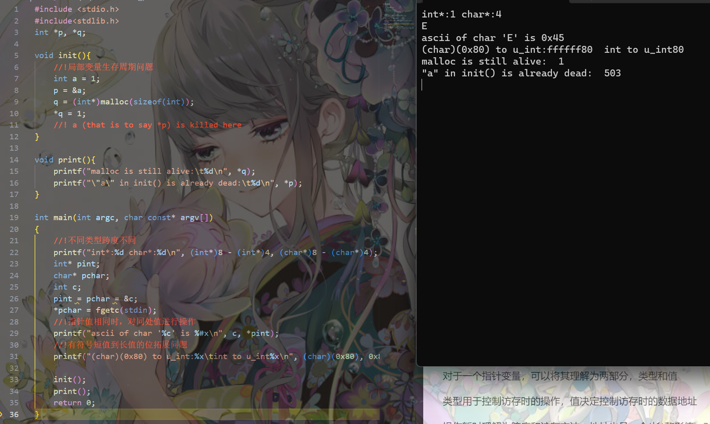

# data struct homework5

更新了头文件，definestack和definequeue支持空格间隔参数，使用也变得人性化

## T1

题意：给出一串数字按照$\color{red}{左子结点值小于根结点值、右子结点值大于等于根结点值的方式}$构造一棵二叉查找树

这棵树保证了对每一个子树，左节点 < 根节点 <= 右节点，因此该树的中序遍历应该是一个不严格递增序列

考察二叉树的建立，按照题目要求建立二叉树后遍历寻找根节点并输出即可。

流程图和代码如下

```puml
note top: 只展示了一个新值读入的场景
(*) --> 读入新值
note right: scanf("%d", &num);\np = root;
--> [<color:red>记得更新节点循环变量p为root</color>] ==B2==
-down->if 当前位置为空 then
note right:if (p==NULL)
    --> [Yes]加新的值插入当前位置
    note top:p = (struct node*)malloc(sizeof(struct node));\np->contnet = num;\np->left = p->right = NULL;
    --> (*)
else
    --> [No]if 新值小于当前节点值 then
    note right:if (p->content > num)
        --> [Yes]节点循环变量p变自身的左子节点
        note bottom:p = p->left;
        -->==B1==
    else
        --> [No<color:red>注意等于</color>]节点循环变量p变自身的右子节点
        note bottom:p = p->right
        -->==B1==
    endif
    -up->==B2==
endif
```

输出时要求从左到右的根节点，使用非层次遍历以外的遍历寻找到根节点的时候输出即可

```c
//二叉树的三种深搜遍历
//前序
void preDFS(struct Node* node) {
    if (node == NULL/*end condition*/) {//退出条件
        return;
    }
    if (node->left == NULL && node->right == NULL)//*handle node here
        printf("%d ", node->content);
    preDFS(node->left);
    preDFS(node->right);
}
//中序
void midDFS(struct Node* node) {
    if (node == NULL/*end condition*/) {//退出条件
        return;
    }
    midDFS(node->left);
    if (node->left == NULL && node->right == NULL)//*handle node here
        printf("%d ", node->content);
    midDFS(node->right);
}
//后序
void postDFS(struct Node* node) {
    if (node == NULL/*end condition*/) {//退出条件
        return;
    }
    postDFS(node->left);
    postDFS(node->right);
    if (node->left == NULL && node->right == NULL)//*handle node here
        printf("%d ", node->content);
}
```

## T2

$\color{red}{读题很重要}$，注意字典序要求，字典序排序和C语言的string.h库的函数是相适应的，使用string.h库的函数$\color{red}{注意\backslash0是用于判定字符串结尾的标准，\backslash0后的会被视为没有，而缺失\backslash0会发生意想不到的事情}$

这个题的建树和上题如出一辙，注意几个问题

- 结构体成员相比第一题增加了次数
- 单词比较标准是字典序(用strcmp)
- 单词相同时不是移到右节点而是在当前节点上次数加一然后直接结束对当前单词的操作

建树标准

1. 当前节点是NULL，在此新建节点，并结束
2. 当前节点不是NULL

       单词相同，查找次数加一，退出
       字典序小的往左子节点找，回到第 1 步 
       字典序大的往右子节点找，回到第 1 步

(如果你建树是其它标准，那么多半前三个单词会错)

输出部分需要字典序输出，使用中序遍历

## T3

有同学反映上次计算表达式把操作符压栈和计算放一起做很抽象，吸取上次教训，这次分两步:建树和算树

操作栈的进出逻辑之前写了，这里就不再写了

相比直接计算设置操作符栈和操作数栈，这里需要设置的是操作符栈和树节点栈
当有符号出操作符栈时

- 读入操作数，直接建立节点入栈

```c
if ('0' <= read[i] && read[i] <= '9') {
    j = 0;
    while ('0' <= read[i] && read[i] <= '9') {
        j = j * 10 + read[i] - '0';
        i++;
    }
    // 数字节点直接入栈
    p = (struct Node*)malloc(sizeof(struct Node));
    p->content = j;
    p->type = 1;
    p->left = p->right = NULL;
    stack_pushback(nodeStack, p);
}
```

- 新建操作符号节点 (除非是'\('，是'\('的话抛弃掉)
- 取树节点栈的栈顶两个节点，将它们设置为新建操作符号节点的右左子节点(压栈顺序导致"右左")

```c
while (!StackEmpty(opStack) && pri[stack_visit(opStack)] >= pri[read[i]]) {
    p = (struct Node*)malloc(sizeof(struct Node));
    p->content = stack_popup(opStack);
    p->type = 0;
    // 新节点获得俩子节点
    p->right = stack_popup(nodeStack);
    p->left = stack_popup(nodeStack);
    // 初始化后入栈
    stack_pushback(nodeStack, p);
}
```

- 将新建操作符号节点压入栈内

$\color{red}{注意左右括号至始至终就不能在树里面}$

对于节点的设计建议用两个成员，一个标定内容，一个标定类型

```c
struct Node{
    char type;//type == 0表示是操作符号；非0表示是操作数
    int content;
    struct Node *left, *right;
}
```

~~可能有人疑惑 int content 怎么存符号，自行解决了，到现在还不懂，那难以讲懂了，请百度"C语言数据类型"~~

如何用树进行计算，

```puml
skinparam componentStyle rectangle
[' + '] --> [2]
[' + '] --> [' * ']
[' * '] --> [1]
[' * '] --> [3]
```

显然是先算1*3得到3再计算2+3得到5

定义函数效果是计算到当前树节点
对于每个节点，如果是数字，那么它已经算完了。如果是符号，那么它需要获取两个操作数，也就是左右节点，这就要求左右节点算完，所以是后序遍历

```c
int postDFS(struct Node* node){
    if (node->type != 0)
        return node->content;
    int a = postDFS(node->left);
    int b = postDFS(node->right);
    switch(node->content){
        case '+':
            return a + b;
        ...
        case '/':
            return a / b;
        default:
            assert(false);
            exit(1);
    }
}  
```

## T4

题面很复杂，总结下就是给一颗三叉树，现在需要将树的(非分叉节点，也就是叶子节点)进行顺序交换。

面临的问题大概是节点有不同类型，其次是从上到下从左到右的实现

推荐直接数组模拟，多类型节点，分叉结点编号大于等于100，登机口为编号小于100的数字（编号没有规律但不会重复，其一定是一个叶结点），都暗示数组模拟树会方便许多

用下标(+100)代表分叉节点的编号，用int[3]的数组代表分支的下标


101, 102, 103, 5, 104, 6 ....


输入处理：

```c
//第一部分，分支信息部分
while (~scanf("%d", &n) && n!=-1) {
    j = 0;
    while (~scanf("%d", &m) && m != -1) {
        branch[n][j] = m;
        j++;
    }
}
//第二部分，登机口信息部分
while (~scanf("%d", &m, &n)) {
    port[m][0] = n;
    port[m][1] = m;//记录节点自行原本信息，便于排序
}
```

从上到下，从左到右的实现，层序遍历(广度优先搜索)，控制搜索深度，相比于深度优先搜索(栈)一条路走到底，用对列控制入队的顺序（按层数最低最左边的顺序入栈）可以保证出队顺序

```c
left = 0;
right = 1;
queue[0] = initial;
while (left < right) {
    //part one
    /*if it is time to end then break*/

    //part two
    /*handle this node*/

    //part three
    /*add next node*/
    for ( i; ; ) {
        if (/*condition*/) {
            queue[right++] = /*one child node of queue[left] */;
        }
    }

    //part four
    left++;
}
```

## T experiment

常见问题：

- 局部变量生存周期问题：一个函数内声明的局部变量无法被另一个函数使用
    解决办法是使用malloc/calloc 或者 全局变量
- 不会写qsort的cmp函数
    对指针不熟悉
- 森林数组不判断是否完全合并

### 指针速成

对于一个指针变量，可以将其理解为两部分，类型和值

类型用于控制访存时的操作，值决定控制访存时的数据地址

操作暂时理解为跨度和访存方法，地址也是一个(长)整形值，对于声明的局部指针变量，其他函数看不到它，也不知道它的值是多少，但是，它操作的内容可以被看到

对于 cmp 函数内的指针变量：

```c
qsort(port, 100, sizeof(int[2]), comp);

int comp(const void* a, const void* b)
{
    int *pa = *(int(*)[2])(a), *pb = *(int(*)[2])(b);
    // int *pa = *(int **)a, *pb = (int *)b;也行
    if (pa[1] == pb[1])
        return pa[0] < pb[0] ? -1 : 1;
    else
        return pa[1] < pb[1] ? 1 : -1;
}
```

鲜活的例子：



```c
#include <stdio.h>
#include<stdlib.h>
int *p, *q;

void init(){
    //!局部变量生存周期问题
    int a = 1;
    p = &a;
    q = (int*)malloc(sizeof(int));
    *q = 1;
    //! a (that is to say *p) is killed here
}

void print(){
    printf("malloc is still alive:\t%d\n", *q);
    printf("\"a\" in init() is already dead:\t%d\n", *p);
}

int main(int argc, char const* argv[])
{
    //!不同类型跨度不同
    printf("int*:%d char*:%d\n", (int*)8 - (int*)4, (char*)8 - (char*)4);
    int* pint;
    char* pchar;
    int c;
    pint = pchar = &c;
    *pchar = fgetc(stdin);
    //!指针值相同时，对同处值进行操作
    printf("ascii of char '%c' is %#x\n", c, *pint);
    //!有符号短值到长值的位拓展问题
    printf("(char)(0x80) to u_int:%x\tint to u_int%x\n", (char)(0x80), 0x80);

    init();
    print();
    return 0;
}
```