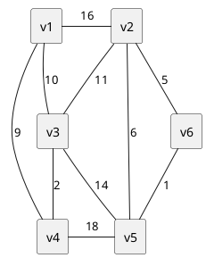
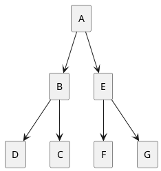

# Mock Exam

## 选择题

1. 中缀表达式A-(B+C/D)×E的后缀形式是 __________。
    A. `ABC+D/×E-` B. `ABCD/+E×-` C. `AB-C+D/E×` D. `ABC-+D/E×`

        选B
        最后算 - ，故 - 在末尾，其前算 × ，AB均可。但是`E参与 × 运算，应在其前，选B

2. 若利用快速排序算法进行从小到大排序，下列选项中，不可能是经过两次选择分界元素并确定其最终位置后的排序结果的是__________。
   A. 2,3,5,4,6,7,9
   B. 2,7,5,6,4,3,9
   C. 3,2,5,4,7,6,9
   D. 4,2,3,5,7,6,9

        选C
        快速排序的分界元素左边均小于它，右边均大于它，判断时可以是两端（少判一边）
        A. 2, 3, 6, 7, 9
        B. 2, 9
        C. 9
        D. 5, 9

3. 任何一个无向连通图的最小生成树 __________。
    A．只有一棵 B. 一棵或多棵 C. 一定有多棵 D. 可能不存在

        选B
        无向连通图一顶有最小生成树，可能唯一，可能不唯一，但是总代价一定一致
        最小生成树的算法(kruskal和prim)

4. 有11个叶结点的哈夫曼树共有 __________ 个结点。
    A.22       B.21       C.20       D.19

        选B
        11 + 10 = 21

## 填空题

1. 对于上图所示的无向连通图，若采用普里姆（Prim）算法求其最小生成树，假设第一个选择加入最小生成树的顶点为V1，则最后一条加入最小生成树的边的权值为 \_\_\_\_1\_\_\_\_。

     | v1  | v2  | v3  | v4  | v5       | v6       |
     | --- | --- | --- | --- | -------- | -------- |
     | x   | 16  | 10  | 9   | $\infin$ | $\infin$ |
     |     | 16  | 2   | x   | 18       | $\infin$ |
     |     | 11  | x   |     | 14       | $\infin$ |
     |     | x   |     |     | 6        | 5        |
     |     |     |     |     | 1        | x        |
     |     |     |     |     | x        |          |1

2. 若一个待散列存储的线性表为K=(18,25,63,50,42,32,9,45)，散列函数为H(k) = k MOD 9，则与元素18发生冲突的元素有_____3_____ 个。
3. 已知二叉树的前序遍历序列为ABDCEFG,中序遍历序列是DBCAFEG,则其后序遍历序列为__DCBFGEA_。(答案中不要加空格及其他符号)

        前序遍历可知根节点为A, 再中序遍历可知DBC左枝, FEG右枝
        前序遍历BDC和中序遍历DBC可知, B为左子树根节点, DC分别是其左右子节点
        前序遍历EFG和中序遍历FEG可知, E为右子树根节点, FG分别是其左右子节点

1. 栈R,从顶到底:{2,4,6,8,10},逐个取出放入队列Q中 ，再从Q中逐个取出放入R中，问现在栈R中从顶到底的顺序为 __{10,8,6,4,2}_。
输出格式：{1,2,3,4,5}

## 编程题

### 【问题描述】

某教学平台具有考试登录异常检测功能，检测规则如下：

1. 考试开始后，如果同一账号在不同机器上登录，系统将报警输出异常登录信息（可能存在私自换机器的情况）；
2. 考试开始后，如果同一账号在同一机器上多次登录，属于正常情况，系统不报警。

编写程序，读入某次考试学生的登录日志信息，对其进行异常检测，输出异常登录信息。日志信息包括学生学号（即学生账号，唯一标识学生身份的信息，用一整数表示，不超过int的表示范围）、学生姓名（用不含空白符的字符串表示，字符个数不超过15）、机器号（用一整数表示，不超过int的表示范围）、登录时间（用包含6个数字的字符串表示，例如：093756，表示9点37分56秒）。

### 【输入形式】

先从控制台输入日志信息条数（不超过200条），然后按照登录先后顺序分行输入日志信息，每条信息包括学号、姓名、机器号和登录时间，以一个空格分隔各数据。

### 【输出形式】

按照学号从小到大的顺序输出登录异常账号信息（仅包括学号和姓名），每条信息独占一行，学号和姓名以一个空格分隔。如果没有异常登录信息，则什么都不输出。

### 【样例输入】

21
191028 wangdi 15 093000
192387 litong 39 093000
190877 liugang 37 093001
197583 huangqinian 196 093004
195211 liuhao 201 093005
193098 zhaogang 377 093006
190001 zhousheng 1 093007
190009 wuhong 12 093007
197583 huangqinian 197 093008
195877 lisisi 202 093008
192387 litong 309 093009
191000 tonghao 201 093402
197583 huangqinian 196 093500
191028 wangdi 15 093507
190010 wangzhuang 85 093558
195333 zhangye 63 093600
197583 huangqinian 195 094100
195211 liuhao 200 095103
190010 wangzhuang 287 095509
193098 zhaogang 377 095606
191028 wangdi 15 095709

### 【样例输出】

190010 wangzhuang
192387 litong
195211 liuhao
197583 huangqinian

### 【样例说明】

输入了21条登录日志信息，其中有四位学生（学号分别为190010、192387、195211和197583）在多台机器上登录，属于异常登录，输出异常账号登录信息；注意：学号为191028的学生在15号机器上有多次登录，属于正常重复登录。

### 【评分标准】

该题要求辨别输出异常登录信息，提交程序名为login.c。
